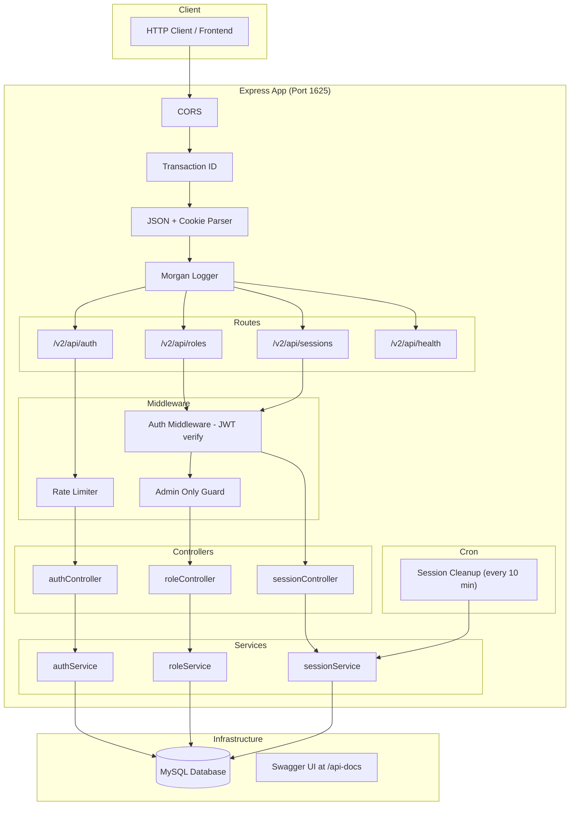
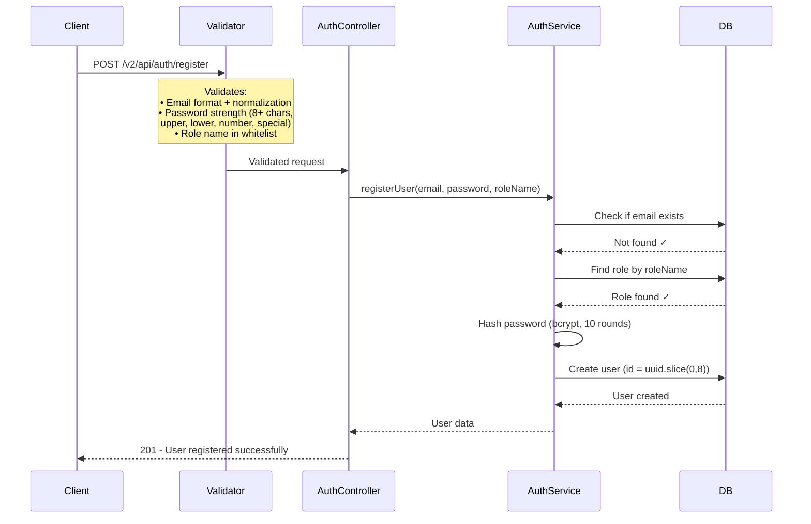
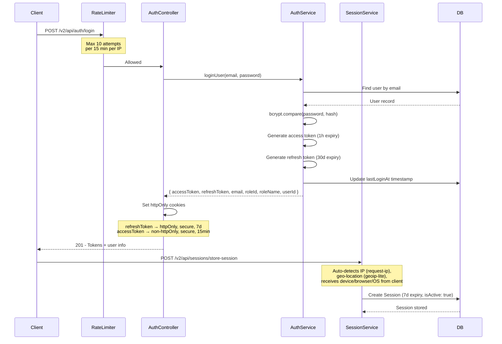
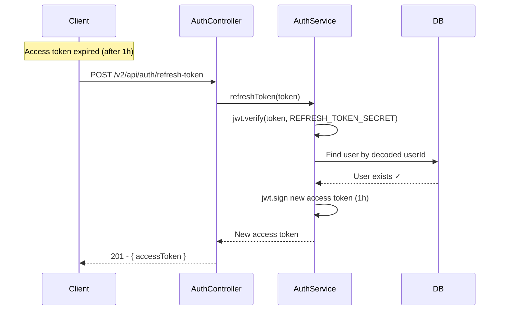
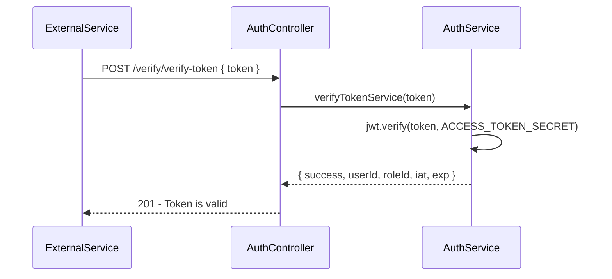
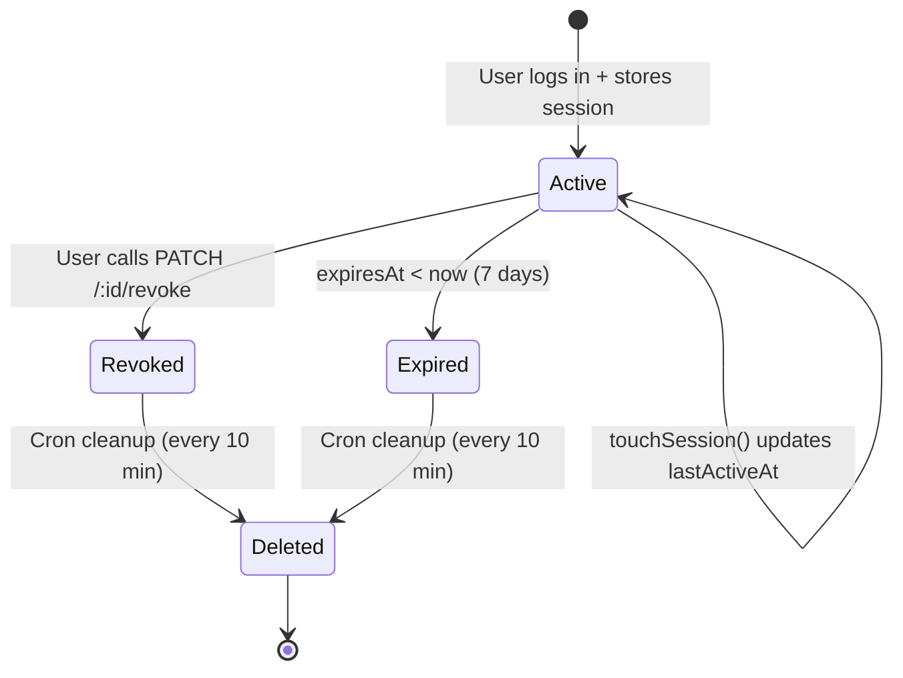
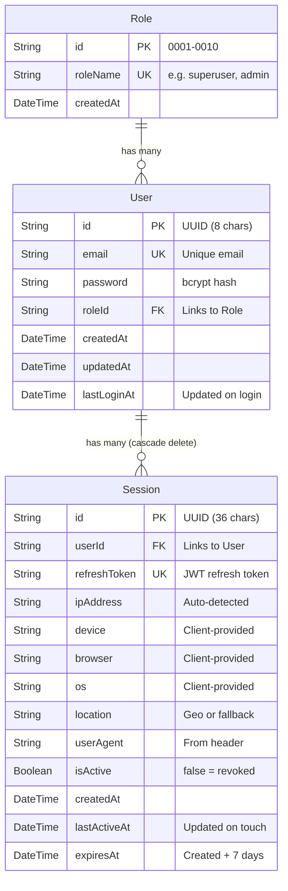

# Architecture & Knowledge Transfer Guide

> Deep-dive into how **ts-auth-service-1625** works — architecture, auth flows, database design, security model, and codebase walkthrough.

---

## Table of Contents

- [Architecture Overview](#architecture-overview)
- [Request Lifecycle](#request-lifecycle)
- [Authentication Flows](#authentication-flows)
  - [Registration](#registration-flow)
  - [Login + Session Creation](#login--session-flow)
  - [Token Refresh](#token-refresh-flow)
  - [Token Verification](#token-verification)
- [Session Lifecycle](#session-lifecycle)
- [Database Schema](#database-schema)
- [Project Structure](#project-structure)
- [Security Model](#security-model)
- [API Reference (Detailed)](#api-reference-detailed)
- [Seeded Data](#seeded-data)
- [DevOps](#devops)

---

## Architecture Overview



---

## Request Lifecycle

Every incoming request passes through this middleware chain before reaching any route:

```
Client Request
  → CORS (allow all origins)
  → Transaction ID Middleware (attaches UUID to req.transactionId)
  → JSON Body Parser
  → Cookie Parser
  → Morgan HTTP Logger
  → Route Handler
```

**Transaction IDs** — Every API response includes a unique `transactionId` field for traceability. This is generated in `transactionIdMiddleware.ts` and threaded through controllers into response utils.

**Protected Routes** — Routes under `/sessions` (except `/validate-session`) and `/roles` pass through the `authMiddleware` which extracts and verifies the JWT from the `Authorization: Bearer <token>` header. Role routes additionally pass through `adminOnly` which checks for superuser role (`roleId: 0001`).

---

## Authentication Flows

### Registration Flow



**Key logic in `authService.ts → registerUser()`:**
1. Validates email/password/roleName are present
2. Checks for duplicate email
3. Looks up role by name (must exist in DB)
4. Hashes password with bcrypt (10 salt rounds)
5. Creates user with truncated UUID as ID

---

### Login + Session Flow



**Key logic in `authService.ts → loginUser()`:**
1. Finds user by email (throws if not found)
2. Compares password with bcrypt
3. Generates JWT access token (1h) with `{ userId, roleId, email }`
4. Generates JWT refresh token (30d) with `{ userId }`
5. Updates `lastLoginAt` in DB
6. Returns tokens + role info

**Cookie behavior (`authController.ts → setCookies()`):**
- `refreshToken` cookie: httpOnly, secure in production, sameSite: none, 7 days
- `accessToken` cookie: NOT httpOnly (client JS can read), secure in production, 15 min

---

### Token Refresh Flow



**Note:** The refresh token endpoint in `authService.ts` creates a new access token with `{ userId, roleId }` (15 min expiry hardcoded), while `generateTokens.ts` uses 1h. This is an intentional override for refresh-generated tokens.

---

### Token Verification

Used by other microservices to validate a token issued by this service.



---

## Session Lifecycle



**Session metadata captured:**
- IP address (auto-detected via `request-ip`)
- Geo-location (city, country via `geoip-lite` — falls back to client-provided timezone on localhost)
- Device, Browser, OS (sent by client)
- User-Agent header

**Session cleanup (`cron/sessionCleanup.ts`):**
- Runs on server startup, then every 10 minutes
- Deletes sessions where `isActive = false` OR `expiresAt < now`
- Logs cleanup results via Winston

**Session validation (`/validate-session`):**
Returns one of three statuses:
- `ACTIVE` → Session is valid, updates `lastActiveAt`
- `REVOKED` → Session was terminated by user
- `NOT_FOUND` → Session doesn't exist
- `EXPIRED` → Session past expiry date

---

## Database Schema



**Cascade behavior:** Deleting a `User` automatically deletes all their `Session` records (`onDelete: Cascade`).

**Additional models** in the schema (`user_profile`, `billing`, `group_table`, `project`, `team`) are organizational placeholders not yet integrated into the auth logic.

---

## Project Structure

```
src/
├── app.ts                          # Express app: middleware chain + route mounting
├── server.ts                       # Entry: starts HTTP server, connects DB, inits cron
│
├── config/
│   ├── db.ts                       # Prisma client singleton + connectToDatabase()
│   ├── mail.ts                     # Nodemailer Gmail transport
│   ├── seed.ts                     # Seeds 10 roles + 5 default users
│   └── swagger.ts                  # Swagger/OpenAPI setup → serves at /api-docs
│
├── controller/
│   ├── authController.ts           # register, login, changePassword, refreshToken, verifyToken
│   ├── roleController.ts           # addRole, editRole
│   └── sessionController.ts        # storeSession, getSessions, revokeSession, validateSession
│
├── services/
│   ├── authService.ts              # Core auth: register, login, password, tokens
│   ├── roleService.ts              # Role CRUD (create, update)
│   └── sessionService.ts           # Session CRUD, validation, cleanup
│
├── routes/
│   ├── authRoutes.ts               # POST /register, /login, /change-password, /refresh-token, /verify
│   ├── roleRoutes.ts               # POST /add-roles, PUT /edit-roles (admin-protected)
│   ├── sessionRoutes.ts            # Session CRUD routes (auth-protected except validate)
│   └── healthCheckRoutes.ts        # GET /health-check
│
├── middleware/
│   ├── authMiddleware.ts           # JWT verification → sets req.user; adminOnly role check
│   ├── rateLimitMiddleware.ts      # 10 requests / 15 min window on login
│   ├── transactionIdMiddleware.ts  # Attaches UUID to every request
│   └── loggerConsole.ts            # Morgan 'combined' HTTP logging
│
├── utils/
│   ├── generateTokens.ts           # JWT: access (1h) + refresh (30d) generators
│   ├── hashPassword.ts             # bcrypt hash & compare wrappers
│   ├── logger.ts                   # Winston: console + file (combined.log)
│   ├── responseUtils.ts            # Standardized { success, transactionId, message, data } format
│   ├── transactionId.ts            # UUID v4 generator
│   └── validator.ts                # Email normalization, password rules, role whitelist
│
├── types/
│   ├── ApiResponse.ts              # Generic response interface
│   └── express.d.ts                # Global augmentation: req.transactionId, req.user
│
└── cron/
    └── sessionCleanup.ts           # Runs on startup + every 10 min; purges dead sessions
```

---

## Security Model

| Layer | Mechanism | Detail |
|---|---|---|
| **Password storage** | bcrypt | 10 salt rounds |
| **Password policy** | Validator middleware | Min 8 chars, 1 uppercase, 1 lowercase, 1 number, 1 special |
| **Access tokens** | JWT | 1 hour expiry, payload: `{ userId, roleId, email }` |
| **Refresh tokens** | JWT | 30 day expiry, payload: `{ userId }` |
| **Token storage** | httpOnly cookie | Refresh token in httpOnly cookie (XSS protection) |
| **Brute force** | express-rate-limit | 10 login attempts per 15 min per IP |
| **Authorization** | Role-based | `authMiddleware` verifies JWT; `adminOnly` checks roleId = 0001 |
| **Session hygiene** | Cron job | Cleans expired/revoked sessions every 10 min |
| **Traceability** | Transaction IDs | UUID on every request for logging/debugging |
| **Input validation** | validator.js | Email normalization, role whitelist |

---

## API Reference (Detailed)

### POST `/v2/api/auth/register`

```json
// Request
{
  "email": "user@example.com",
  "password": "MyStr0ng!Pass",
  "roleName": "user"
}

// Success (201)
{
  "success": true,
  "transactionId": "a43282df-...",
  "message": "User registered successfully",
  "data": {
    "id": "c3e70bd9",
    "email": "user@example.com",
    "password": "$2b$10$...",
    "roleId": "0005",
    "createdAt": "2024-09-13T20:12:09.808Z",
    "updatedAt": "2024-09-13T20:12:09.808Z",
    "lastLoginAt": null
  }
}

// Error (400)
{ "success": false, "message": "Registration error", "error": "User already exists with this email." }
```

### POST `/v2/api/auth/login`

```json
// Request
{ "email": "user@example.com", "password": "MyStr0ng!Pass" }

// Success (201) — sets refreshToken + accessToken cookies
{
  "success": true,
  "transactionId": "f206b71c-...",
  "message": "User logged in successfully",
  "data": {
    "accessToken": "eyJhbG...",
    "refreshToken": "eyJhbG...",
    "email": "user@example.com",
    "roleId": "0005",
    "roleName": "user",
    "userId": "c3e70bd9"
  }
}

// Error (401)
{ "success": false, "message": "Login error", "error": "Invalid credentials" }
// Error (429) — rate limited
"Too many login attempts, please try again later."
```

### POST `/v2/api/auth/refresh-token`

```json
// Request
{ "refreshToken": "eyJhbG..." }

// Success (201)
{ "success": true, "message": "Refresh token generated", "data": { "accessToken": "eyJhbG..." } }
```

### POST `/v2/api/auth/verify/verify-token`

```json
// Request
{ "token": "eyJhbG..." }

// Success (201)
{
  "success": true,
  "message": "Token verified successfully",
  "data": { "success": true, "message": "Token is valid", "userId": "c3e70bd9", "roleId": "0001", "iat": 1726305708, "exp": 1726306608 }
}
```

### POST `/v2/api/auth/change-password`

```json
// Request
{ "email": "user@example.com", "currentPassword": "MyStr0ng!Pass", "newPassword": "NewStr0ng!Pass" }

// Success (201)
{ "success": true, "message": "Password changed successfully", "data": "Password updated successfully" }
```

### POST `/v2/api/sessions/store-session` (Auth required)

```json
// Request
{
  "refreshToken": "eyJhbG...",
  "device": "Desktop",
  "browser": "Chrome 120",
  "os": "Windows 11",
  "location": "Asia/Kolkata"
}

// Success (201)
{ "success": true, "message": "Session stored", "data": { "id": "uuid-...", "userId": "c3e70bd9", ... } }
```

### POST `/v2/api/sessions/validate-session`

```json
// Request
{ "refreshToken": "eyJhbG..." }

// Response (200) — always 200, check isValid
{
  "success": true,
  "message": "Session validation completed",
  "data": { "isValid": true, "status": "ACTIVE", "message": "Session is valid" }
}
// or
{ "data": { "isValid": false, "status": "REVOKED", "message": "Session has been terminated" } }
// or
{ "data": { "isValid": false, "status": "EXPIRED", "message": "Session has expired" } }
```

---

## Seeded Data

Run `npm run seed` to populate:

**10 Roles:**

| ID | Role |
|---|---|
| 0001 | superuser |
| 0002 | admin |
| 0003 | editor |
| 0004 | viewer |
| 0005 | user |
| 0006 | guest |
| 0007 | moderator |
| 0008 | operator |
| 0009 | analyst |
| 0010 | developer |

**5 Default Users** (all with password: `password`):
- superuser@gmail.com (superuser)
- admin@gmail.com (admin)
- user@gmail.com (user)
- guest@gmail.com (guest)
- developer@gmail.com (developer)

---

## DevOps

### Docker

```dockerfile
# Dockerfile: Node 18, npm install, prisma generate, exposes 1625
docker compose up -d
```

### Jenkins CI/CD

4-stage pipeline in `Jenkinsfile`:

```
Checkout → Build & Test (npm ci + npm test) → Docker Build → Deploy (docker compose up)
```

### Logging

- **Winston** → Console (colorized) + `combined.log` (JSON format)
- **Morgan** → HTTP request logging in `combined` format
- All logs include timestamps in `YYYY-MM-DD HH:mm:ss` format
